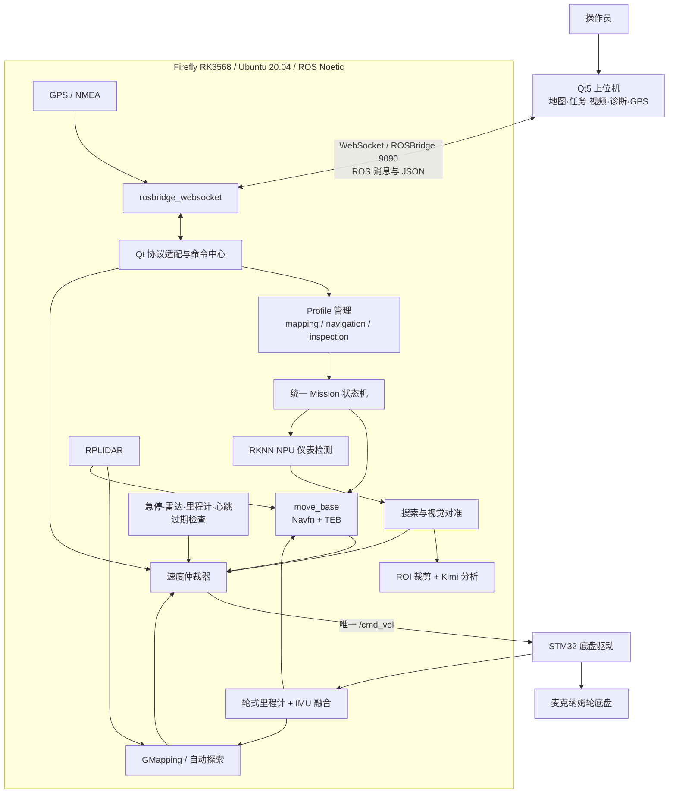
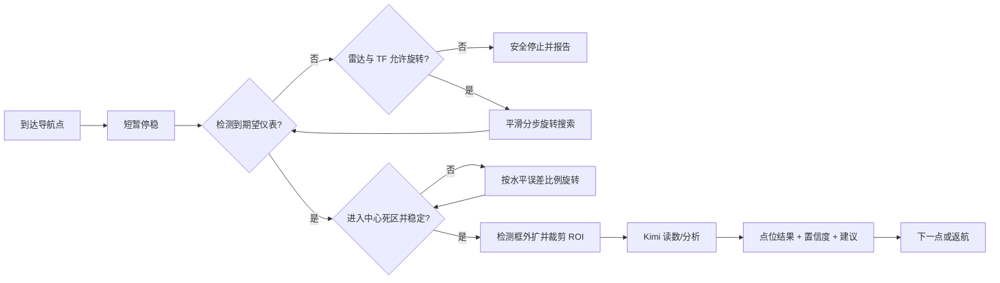

# Eggy 智能巡检移动机器人——比赛答辩与技术查阅手册

> 适用对象：项目成员、比赛讲解人员、答辩人员。
>
> 代码基线：Qt 上位机 `65c945f`，Firefly ROS 工作空间 `1cee0a1`。
>
> 核验日期：2026-07-20。本文以仓库代码、launch、参数文件和已经完成的实车联调为依据；参数以后若有调整，应以运行时 ROS 参数为最终事实。

---

## 快速目录

- [项目介绍、场景与总体架构](#1-一句话介绍项目)
- [硬件、软件与三种运行模式](#5-硬件组成与职责)
- [Qt、ROSBridge 与底盘控制](#8-qt-上位机设计)
- [速度仲裁、定位、建图与导航](#11-速度仲裁与急停)
- [统一任务与视觉巡检闭环](#16-统一-mission单点任务链与巡检)
- [NPU、Kimi、语音与 GPS](#18-rk3568-npu-仪表检测)
- [网络、诊断、性能与交付](#22-网络与远程连接)
- [创新点与评委高频问答](#26-项目创新点如何回答)
- [演示流程、参数和术语速查](#28-推荐比赛演示顺序)
- [表述边界与代码查阅入口](#31-答辩时应坚持的表述边界)

---

## 1. 一句话介绍项目

Eggy 是一套面向室内设备巡检的全向移动机器人系统：机器人可自主建图、固定地图定位与导航、执行单点或多点任务，在到达仪表附近后利用 RK3568 NPU 检测水表和压力表，通过视觉闭环调整车体朝向，再裁剪目标区域交给 Kimi 多模态模型分析，并由 Qt5 上位机统一完成地图、任务、视频、诊断、语音和 GPS 信息的交互展示。

## 2. 不同时间长度的项目介绍

### 2.1 30 秒版本

本项目是一辆基于 Firefly RK3568、ROS1 和麦克纳姆底盘的智能巡检小车。它既能由 Qt 上位机遥控，也能自主建图、AMCL 定位、规划路径和多点巡航。到达巡检点后，板端 NPU 先识别水表或压力表，小车通过检测框做视觉对准，再把带边距的目标 ROI 交给 Kimi 读取和分析。系统采用统一任务协议、运行模式隔离、速度优先级仲裁、急停和传感器超时停车，兼顾功能完整性与实车安全。

### 2.2 2 分钟版本

项目要解决的是传统人工巡检重复、危险、记录不统一的问题。系统分为四层：STM32 底盘实时层、Firefly ROS 决策层、ROSBridge 通信层和 Qt5 操作层。STM32 负责轮速、IMU、电池、急停状态及底盘执行；Firefly 运行雷达、里程计融合、SLAM、AMCL、move_base、RKNN 识别、Kimi 桥接和任务状态机；Qt 只发送经过定义的任务与控制请求，并负责可视化，不把复杂决策放在不稳定的网络另一端。

系统有建图、导航、巡检三种互斥 profile。建图模式由 GMapping 维护 `map→odom`；导航和巡检模式加载静态地图，由 AMCL 维护 `map→odom`，避免两个定位源冲突。单点导航和多点路线使用同一 Mission JSON，路线只有一个点就是单点任务，多个点就是任务链；`inspection.enabled` 决定到点后是否执行视觉巡检。

巡检时先由 move_base 到达点位，RKNN 在 NPU 上检测目标。如果目标在画面边缘，小车按检测框中心误差平滑旋转；进入中心死区并稳定保持后停止调整。若没有发现目标，则在雷达安全间距允许时分步旋转搜索。目标确认后，系统按检测框加约 18% 边距裁剪 ROI，以 JPEG 高质量编码送给 Kimi，而不是上传整张带框视频。最终结果按 `request_id` 和点位 ID 回到 Qt，形成可追踪闭环。

### 2.3 适合答辩收尾的一句话

我们的创新不只是把若干 ROS 节点拼在一起，而是把“任务、定位、视觉、AI、运动和安全”组织成一套有权威状态、有反馈、有超时、有降级的工程闭环。

---

## 3. 应用场景与项目价值

### 3.1 主要应用场景

1. 水务、泵房、管廊中的水表和压力表巡检。
2. 工厂、实验室、仓储区域的固定点位周期巡航。
3. 不适合人员频繁进入的狭窄、潮湿、噪声或轻度危险环境。
4. 教学与竞赛中的 SLAM、导航、嵌入式 AI 和人机交互综合平台。
5. 通过 4G 与 Tailscale 进行异地状态查看和任务下发。

### 3.2 相比单一遥控车的提升

| 传统方式 | Eggy 的改进 |
| --- | --- |
| 人工遥控到每个设备 | 地图导航与多点任务链自动执行 |
| 人工判断仪表读数 | NPU 检测 + ROI + 多模态分析 |
| 多个节点都能直接发速度 | 单一 `/cmd_vel` 仲裁出口 |
| 故障后继续使用旧数据 | 数据年龄、租约超时和失效安全停车 |
| 上位机与板端逻辑耦合 | 稳定 JSON/ROS 话题契约隔离两端 |
| 只能同一 Wi-Fi 使用 | ROSBridge 可走局域网或 Tailscale/4G |

---

## 4. 总体系统架构



### 4.1 为什么这样分层

- **实时性分层**：电机和串口控制放在 STM32/板端，不依赖 Windows 网络调度。
- **权威状态分层**：任务是否成功由板端状态机判断，Qt 的按钮点击不等于执行成功。
- **安全分层**：所有速度源必须经过仲裁器，任何上层模块都不能绕过安全出口。
- **带宽分层**：ROSBridge 只传必要数据；NPU、图像裁剪和 AI 请求尽量在板端完成。
- **可维护性分层**：Qt、ROS、STM32 可以分别迭代，通过稳定话题和 JSON 契约协作。

---

## 5. 硬件组成与职责

| 硬件 | 主要职责 | 项目中的接口 |
| --- | --- | --- |
| Firefly RK3568 | ROS 主控、路径规划、NPU 推理、网络服务 | Ubuntu 20.04、ROS Noetic、RKNN |
| STM32 控制板 | 底盘实时控制、速度反馈、IMU、电压、急停标志 | 115200 bit/s 串口，自定义 11/24 字节帧 |
| 麦克纳姆轮底盘 | 前后、旋转及受约束横移 | `vx`、`vy`、`wz` |
| RPLIDAR | 环境轮廓、SLAM、定位、障碍物检测 | `/scan` |
| Orbbec/UVC RGB 相机 | 仪表画面输入 | 1280×720、10 fps、MJPEG 请求值 |
| CI1302 语音模块 | 离线命令词识别与播报 | UART5，经 STM32 转发至 ROS |
| GPS 模块（CH340） | 室外经纬度、卫星和定位质量 | USB `1a86:7523`、9600 bit/s、NMEA |
| DHT 温湿度链路 | 环境温湿度展示 | `/stm32/dht11/temperature`、`humidity` |
| 4G 模组 | 外网接入，为 Tailscale 提供底层网络 | 不改变 ROS 消息协议 |

注意：GPS 目前用于室外地理位置显示，不参与室内 AMCL 定位。室内导航仍依赖雷达、轮式里程计、IMU、静态地图和 AMCL。

---

## 6. 软件技术栈

### 6.1 Qt 上位机

- C++17、Qt5 Widgets、Qt Concurrent、Qt SVG。
- Advanced Docking System：面板浮动、停靠、布局保存。
- OpenCV：视频帧处理与显示。
- Eigen：位姿与地图数据计算。
- nlohmann/json、RapidJSON：任务与 ROSBridge JSON。
- WebSocket ROSBridge：无需在 Windows 安装完整 ROS 即可连接 ROS1。
- 自研 MessageBus：通信线程与 GUI 功能解耦。

### 6.2 板端

- Ubuntu 20.04、ROS Noetic、catkin。
- GMapping：二维栅格 SLAM。
- AMCL：基于粒子滤波的静态地图定位。
- move_base：导航框架。
- Navfn：全局路径规划。
- TEB：局部轨迹优化，按麦克纳姆底盘进行受约束全向修正。
- RKNN Runtime：调用 RK3568 NPU。
- OpenCV：图像解码、letterbox、画框、ROI 编码。
- Python/C++ ROS 节点：任务、语音、安全、GPS、健康聚合等。

---

## 7. 三种运行 Profile

| Profile | 定位/建图权威 | 能力 | 明确禁止 |
| --- | --- | --- | --- |
| `mapping` | GMapping 发布 `map→odom` | 手动建图、自动探索、保存地图 | AMCL 与固定地图导航不能同时占用定位链路 |
| `navigation` | map_server + AMCL | 重定位、单点导航、多点任务链、相机原始画面 | 自动建图、NPU/Kimi 巡检能力不作为必需项 |
| `inspection` | map_server + AMCL | 导航全部能力 + RKNN + 搜索对准 + Kimi | GMapping/自动建图 |

### 7.1 为什么必须互斥

GMapping 和 AMCL 都可能发布 `map→odom`。如果同时运行，TF 树会出现两个权威来源，小车在地图中的位置会跳变，雷达点与地图边界无法稳定重合。因此 profile 切换不仅是 UI 标签变化，而是板端启动图、能力、定位器和安全条件的整体切换。

### 7.2 Profile 就绪条件

- `mapping`：必须观察到 GMapping。
- `navigation`：地图有效，同时 AMCL、move_base、Mission runner、相机在线。
- `inspection`：在 navigation 基础上还要求仪表检测、Kimi server 和 Kimi bridge 在线。

---

## 8. Qt 上位机设计

### 8.1 主要界面板块

1. **中央地图**：静态/动态栅格地图、机器人、雷达、路径、代价地图和点位。
2. **连接设置**：局域网 ROSBridge、Tailscale ROSBridge，也保留原生 ROS 通道能力。
3. **速度控制**：八方向、摇杆、全向/转向模式、线速度和角速度上限、急停。
4. **运维面板**：连接、工作模式、任务、摄像头、网络、运行状态和诊断。
5. **导航任务**：点位列表、识别目标、普通/巡检任务、循环、返航、进度和结果。
6. **摄像头窗口**：按需订阅，避免窗口关闭时仍持续占用视频带宽。
7. **卫星定位**：经纬度、海拔、卫星数、HDOP、数据年龄和离线 3D 地球。

### 8.2 地图显示的实时性策略

- 高频显示采用 queue length 1 和 latest-value，旧帧不排队。
- `/scan` ROSBridge 节流约 100 ms；里程计 50 ms；AMCL 位姿 100 ms。
- 地图 500 ms、局部代价地图 200 ms、全局代价地图 500 ms。
- TF 不采用简单丢整包，因为一个 TFMessage 可能包含不同坐标边。
- 路径、位姿、雷达等数据具有年龄概念，过期内容不应继续伪装成实时数据。
- 视频默认约 66 ms 节流，并在窗口不可见时取消订阅。

### 8.3 地图坐标转换

OccupancyGrid 提供分辨率、宽高和原点。Qt 将世界坐标 `(x,y)` 转换到栅格/场景坐标；由于图像行方向与 ROS 地图坐标方向不同，显示层处理翻转。机器人、雷达、路径和点位必须经过同一套变换，否则会出现“地图正确但叠加物错位”。

### 8.4 GPS 地球窗口

- 默认使用 NASA/GSFC 无云地表纹理，可选固定云层影像。
- Qt CPU 端进行球面反投影，不需要 WebEngine、Token 或在线瓦片。
- 支持拖拽、滚轮和按钮缩放；GPS 约 1 Hz，不会挤占导航高频消息。
- 3.5 秒内为新鲜数据，3.5～10 秒显示延迟，超过 10 秒显示过期。
- HDOP 越小通常表示水平几何精度越好，但不能直接等同于“米级误差”。

---

## 9. ROSBridge 通信链路

### 9.1 链路

```text
Qt 业务控件
  → Qt MessageBus
  → RosbridgeComm
  → WebSocket TCP 9090
  → rosbridge_websocket
  → ROS1 topic/service
  → 板端权威节点
```

返回方向反向进入 Qt MessageBus，再由地图、任务、诊断、视频或 GPS Widget 消费。

### 9.2 主要业务话题

| 方向 | 话题 | 类型/格式 | 用途 |
| --- | --- | --- | --- |
| Qt→板端 | `/eggy/mission/request` | `std_msgs/String` JSON | 单点、多点、巡检、取消 |
| 板端→Qt | `/eggy/mission/status` | JSON | 受理、导航、搜索、AI、异常阶段 |
| 板端→Qt | `/eggy/mission/result` | JSON | 最终逐点结果 |
| Qt→板端 | `/cmd_vel/manual` | `geometry_msgs/Twist` | 手动遥控 |
| Qt→板端 | `/eggy/emergency_stop` | `std_msgs/Bool` | 软件急停锁存 |
| Qt↔板端 | `/eggy/command/request/response/status` | JSON | 模式、地图、相机、诊断等命令 |
| 板端→Qt | `/map` | `nav_msgs/OccupancyGrid` | 栅格地图 |
| 板端→Qt | `/scan` | `sensor_msgs/LaserScan` | 雷达 |
| 板端→Qt | `/odom`、`/amcl_pose`、`/tf` | ROS 标准消息 | 运动与定位 |
| 板端→Qt | `/camera/front/image/compressed` | JPEG | 带检测框调试画面 |
| 板端→Qt | `/gps/fix` | `sensor_msgs/NavSatFix` | 经纬度与海拔 |
| 板端→Qt | `/gps/status` | JSON | 卫星、HDOP、数据年龄 |

### 9.3 为什么不直接暴露所有内部话题

内部话题是实现细节，随规划器或节点变化可能调整；Qt 应依赖稳定别名和统一状态。这样可以减少不必要的 relay，也避免上位机绑定某个局部规划器的私有名称。

---

## 10. 底盘串口与运动控制

### 10.1 STM32 协议

- 波特率：115200 bit/s。
- 控制帧：11 字节，头 `0x7B`、尾 `0x7D`。
- 状态帧：24 字节。
- 校验：对指定字节执行 XOR。
- 速度单位：ROS 的 m/s、rad/s 乘 1000 转为 int16 传输。
- 底盘驱动控制频率：20 Hz。
- `/cmd_vel` 超时：0.5 s，超时自动发送零速度。
- 上限：`|vx|≤0.5 m/s`、`|vy|≤0.5 m/s`、`|wz|≤1.0 rad/s`，底层固件仍可再次限幅。

### 10.2 状态帧包含

- `flag_stop`。
- `vx`、`vy`、`wz`。
- 三轴加速度和三轴角速度原始量。
- 电池电压。

### 10.3 为什么持续发送速度

底盘命令不是“一次发送后永久执行”，而是带租约的连续控制。发送端失联、卡死或停止刷新后，仲裁器和底盘驱动都会因超时输出零速度。这是典型的 fail-safe 设计。

---

## 11. 速度仲裁与急停

### 11.1 优先级

| 速度源 | 话题 | 优先级 | 租约超时 |
| --- | --- | ---: | ---: |
| 安全控制 | `/cmd_vel/safety` | 100 | 0.5 s |
| 手动遥控 | `/cmd_vel/manual` | 80 | 0.75 s |
| 自动建图 | `/cmd_vel/mapping` | 70 | 0.4 s |
| Mission/视觉调整 | `/cmd_vel/mission` | 60 | 0.6 s |
| 普通导航 | `/cmd_vel/navigation` | 40 | 0.6 s |

仲裁器以 20 Hz 发布唯一 `/cmd_vel`。同一时刻选择“仍在租约内的最高优先级、最新速度源”。

### 11.2 软件急停

急停生效时：

1. 立即发布零速度。
2. 清空所有旧速度租约，解除急停后不会恢复急停前的旧命令。
3. 状态中 `active_source=emergency_stop`。
4. 任务取消由上层命令链同步处理。

边界：软件急停依赖 Qt、网络、ROSBridge、ROS 和板端进程仍能工作，不能替代断电型硬件急停。

---

## 12. 里程计、TF 与定位

### 12.1 坐标系

| 坐标系 | 含义 | 典型发布者 |
| --- | --- | --- |
| `map` | 全局地图坐标，不随短期里程误差漂移 | GMapping 或 AMCL |
| `odom` | 局部连续坐标，允许长期漂移 | 里程计融合节点 |
| `base_link` | 机器人本体中心 | `odom→base_link` TF |
| `laser_frame` | 雷达安装坐标 | URDF/static TF |
| `camera_rgb_frame` | 相机坐标 | 相机/URDF |
| `gps_link` | GPS 天线位置 | GPS 节点消息 frame |

### 12.2 里程计融合

- STM32 原始轮速产生 `/wheel_odom`。
- STM32 IMU 原始数据发布到 `/stm32/imu/data_raw`。
- 默认 C++ 融合器以 30 Hz 发布 `/odom` 和 `odom→base_link`。
- 配置的轮式航向修正率为 0.35。
- 静止线速度阈值 0.015 m/s，静止角速度阈值 0.025 rad/s。
- IMU 零偏学习率 0.002。

融合目标不是让里程计“永远不漂移”，而是保持局部运动连续、降低短期航向漂移；全局误差由 GMapping 或 AMCL 的雷达匹配修正。

### 12.3 AMCL 重定位

Qt 在地图上给出初始位姿和朝向，经 `/initialpose` 发送给 AMCL。AMCL 使用静态地图、雷达观测和里程计运动模型更新粒子分布，生成 `map→odom`。Qt 实时把机器人和雷达统一投影到 map 坐标，操作者可观察雷达轮廓是否与静态墙体重合。

关键 AMCL 参数：

| 参数 | 值 | 作用 |
| --- | ---: | --- |
| `odom_model_type` | `omni` | 适配全向底盘运动模型 |
| 粒子数 | 100～500 | 精度与计算量折中 |
| `update_min_d` | 0.05 m | 移动达到该值触发更新 |
| `update_min_a` | 0.08 rad | 转动达到该值触发更新 |
| `laser_max_beams` | 60 | 雷达束采样量 |
| 激光范围 | 0.15～8.0 m | 有效观测范围 |
| `transform_tolerance` | 0.35 s | TF 时间容忍 |

---

## 13. SLAM 建图

### 13.1 GMapping 原理

GMapping 属于基于 Rao-Blackwellized Particle Filter 的二维激光 SLAM。每个粒子代表一条可能的机器人轨迹，并维护相应地图；雷达扫描匹配用于更新粒子权重，重采样保留更可信的轨迹。

### 13.2 当前关键参数

| 参数 | 值 | 说明 |
| --- | ---: | --- |
| 地图范围 | -8～8 m（X/Y） | 初始配置覆盖 16 m×16 m |
| `delta` | 0.05 m/格 | 5 cm 栅格分辨率 |
| `particles` | 20 | 粒子数量 |
| `map_update_interval` | 1.0 s | 地图更新周期 |
| `linearUpdate` | 0.15 m | 平移更新阈值 |
| `angularUpdate` | 0.15 rad | 旋转更新阈值 |
| `temporalUpdate` | 1.0 s | 时间更新阈值 |
| `maxUrange` | 8.0 m | 使用的最大雷达距离 |
| `minimumScore` | 50 | 扫描匹配最低分数 |

### 13.3 手动推动或遥控时如何匹配新位置

轮式里程计先预测机器人从上一时刻移动到了哪里；GMapping 再用新雷达扫描与已有局部地图做匹配，修正预测误差。因此显示中机器人位姿、激光点和地图边界会一起更新。若轮胎打滑严重、雷达环境缺少特征或 TF 延迟，匹配可能退化。

---

## 14. 自动探索建图

### 14.1 核心思想

自动探索寻找“已知自由区与未知区之间的边界”，即 frontier。系统对候选边界进行筛选和路径可达性检查，选择合适目标交给 move_base，到达后停留观察，再重新计算新的 frontier，直到没有有效边界、达到时限或被人工停止。

### 14.2 状态闭环

`preflight → planning → navigating → observing → returning → final_scan → saving → completed`，中间可进入 `paused` 或错误终态。

### 14.3 关键默认参数

| 参数 | 值 | 说明 |
| --- | ---: | --- |
| 预检超时 | 12 s | 等待地图、雷达、里程计等 |
| 单目标超时 | 90 s | 防止长期困在一个 frontier |
| 到点观察 | 1.5 s | 让雷达补充静态观测 |
| 规划周期 | 1.0 s | frontier 重算周期 |
| 最少已知格 | 800 | 防止地图过小时误判完成 |
| 最短运行 | 60 s | 防止过早结束 |
| 地图稳定时间 | 30 s | 完成判据之一 |
| 连续无 frontier | 3 次 | 过滤瞬时无候选 |
| 候选规划上限 | 6 | 控制路径探测开销 |
| 最小目标距离 | 0.45 m | 避免选择脚下边界 |
| 最终扫描速度 | 0.28 rad/s | 保存前补扫 |
| 启动/临界电压 | 11.0/10.5 V | 电源安全门槛 |

### 14.4 自动建图安全门

原始 move_base 速度先进入 `/cmd_vel/mapping_raw`，安全节点检查雷达、里程计、管理器心跳、软件急停和 STM32 `flag_stop`，再发布 `/cmd_vel/mapping`。雷达默认 0.35 s、里程计 0.60 s、原始速度 0.35 s、心跳 1.0 s 超时。任何关键数据过期即输出零速度。

---

## 15. 固定地图导航

### 15.1 全局规划

Navfn 在全局代价地图上使用栅格搜索得到从当前位置到目标点的无碰撞路径。默认目标容忍距离为 0.30 m，规划频率 1 Hz。

### 15.2 局部规划

TEB 把轨迹表示为带时间间隔的一系列位姿，通过优化同时考虑路径长度、时间、速度、加速度、障碍物距离、目标方向和运动学约束。

项目不是完全放任横移，而是“前进为主、横移纠偏”：

| 参数 | 值 |
| --- | ---: |
| 最大前进速度 | 0.27 m/s |
| 最大后退速度 | 0.10 m/s |
| 最大横移速度 | 0.12 m/s |
| 最大合速度 | 0.30 m/s |
| 最大角速度 | 0.62 rad/s |
| X/Y/角加速度 | 0.45 / 0.28 / 0.85 |
| 控制频率 | 12 Hz（静态导航） |
| 目标位置/角度容差 | 0.15 m / 0.15 rad |
| 参考时间间隔 `dt_ref` | 0.25 s |
| 最小障碍距离 | 0.12 m |
| 膨胀距离 | 0.22 m |

### 15.3 为什么小车有时看起来不像普通汽车

麦克纳姆底盘可横移，运动学自由度比差速车多。如果横移权重过低，会斜着冲；过高则退化成频繁“停车—转头—再走”。当前方案把横移限制在前进速度的一半以内，用它持续消除横向误差，同时提高前进偏好，获得更接近车辆直行但能平滑修正的效果。

### 15.4 代价地图

- 机器人 footprint：长 0.30 m、宽 0.20 m。
- 障碍标记范围：3.5 m；清除射线范围：5.5 m。
- 局部代价地图：3 m×3 m、0.05 m/格、8 Hz 更新、4 Hz 发布。
- 全局代价地图：静态地图、0.05 m/格、2 Hz 更新、1 Hz 发布。
- 膨胀半径：0.22 m；缩放系数 8.0。

---

## 16. 统一 Mission：单点、任务链与巡检

### 16.1 统一协议的意义

单点导航不是另一套特殊实现。路线数组只有一个点就是单点，有多个点就是任务链；是否巡检由 `inspection.enabled` 决定。这样取消、状态、超时、结果和错误处理只维护一套逻辑。

### 16.2 请求核心字段

| 字段 | 说明 |
| --- | --- |
| `schema_version` | 当前为 1，用于协议演进 |
| `request_id` | 全链路唯一关联 ID |
| `command` | `start` 或 `cancel` |
| `mission_type` | `navigation` 或 `inspection` |
| `route[]` | 点位 ID、frame、x、y、yaw、期望类别等 |
| `loop` | 是否循环路线 |
| `return_home` | 完成后是否返回记录起点 |
| `on_nav_failure` | `stop` 或 `skip` |
| `inspection.enabled` | 是否执行到点视觉巡检 |
| `vision_search` | 是否搜索目标 |
| `ai_analysis` | 是否执行多模态分析 |

### 16.3 为什么 `accepted` 不等于完成

`accepted` 只表示板端通过格式与资源检查并接管任务。后续还要经历导航、到达、搜索、对准和 AI 分析。Qt 使用相同 `request_id` 跟踪状态，只有 `completed/cancelled/error` 等终态才能结束任务。

---

## 17. 视觉巡检闭环

### 17.1 完整流程



### 17.2 搜索参数

| 参数 | 当前 launch 值 | 作用 |
| --- | ---: | --- |
| 搜索最低置信度 | 0.55 | 低于此值不接管目标 |
| 稳定帧 | 4 | 降低单帧误检 |
| 首次获取帧 | 1 | 目标出现时快速截获 |
| 丢失宽限 | 0.9 s | 短时遮挡不立即重新搜索 |
| 搜索角速度 | 18°/s | 平滑旋转 |
| 单步搜索角 | 90° | 分段观察而非盲目连续转 |
| 步间停留 | 1.0 s | 获得静态清晰画面 |
| 最大搜索范围 | 360° | 最多完整一圈 |
| 雷达旋转净空 | 0.32 m | 过近不旋转 |

### 17.3 对准参数

| 参数 | 值 |
| --- | ---: |
| 中心进入死区 | 归一化误差 0.12 |
| 中心退出死区 | 0.18 |
| 稳定保持 | 0.45 s |
| 比例增益 `Kp` | 1.25 |
| 最大角速度 | 0.30 rad/s |
| 最小有效角速度 | 0.05 rad/s |
| 角加速度限制 | 0.9 rad/s² |
| 对准超时 | 8.0 s |

使用进入/退出两个不同死区形成滞回，避免检测框在边界抖动时小车反复左右摆头。

### 17.4 关键传感器反馈

- `/scan`：旋转净空和数据年龄。
- TF：实际转过的角度、机器人姿态是否可用。
- `/meter/detection`：类别、置信度、框坐标、源图尺寸。
- move_base action：点位是否真正到达。
- 急停与速度仲裁状态：是否仍拥有运动权。

---

## 18. RK3568 NPU 仪表检测

### 18.1 数据链路

```text
相机 MJPEG 1280×720
  → /camera/front/image_source/compressed（原始）
  → JPEG 解码
  → 保持宽高比 letterbox 到 960×960
  → RGB / UINT8 / NHWC 输入 RKNN
  → RK3568 NPU 推理
  → CPU 完成 DFL、Sigmoid、NMS
  → 框逆映射到 1280×720
  → /meter/detection JSON
  → /camera/front/image/compressed（带框调试画面）
```

### 18.2 模型契约

- 模型：INT8 量化 RKNN。
- 运行时输入：`1×960×960×3`，NHWC。
- 类别：`pressure_gauge`、`water_meter`。
- 三个 raw head：120×120、60×60、30×30。
- 每个输出通道数：66。
- 默认 launch 置信度：0.50；NMS：0.45；每类保留主要框，总检测上限 2。
- overlay JPEG 质量：72。

### 18.3 为什么使用 letterbox

1280×720 如果直接拉伸到正方形，圆形仪表会变形，检测框逆映射也会产生几何误差。letterbox 保持原始宽高比，缩放到 960×540，再在上下填充；后处理保存比例和 padding，将框准确还原到原图。

### 18.4 为什么 NPU 后还有 CPU 后处理

NPU 擅长张量计算，模型输出仍是特征头，需要在 CPU 上完成分布回归解码、概率函数、候选排序和 NMS。这种划分既利用 NPU 加速卷积，又保持后处理可调试。

---

## 19. Kimi 多模态分析

### 19.1 为什么不能直接发送整幅画面

整幅画面包含大量背景，会降低仪表在输入中的像素占比，也增加编码和网络负担。系统使用检测框裁剪，并加入约 18% 边距，保留表盘周围上下文。ROI 编码质量为 92。

### 19.2 链路

1. Mission runner 确认目标类别和框。
2. 发布 `/kimi_inspection/request`，携带任务、点位、`request_id` 和 ROI。
3. Kimi bridge 从原始无框相机话题准备图像。
4. 本地 HTTP 服务默认监听 `127.0.0.1:8000`，调用 `/analyze_meter` 或 `/analyze_pipe`。
5. 结果发布 `/kimi_inspection/result`，再合并到 Mission 点位结果。

### 19.3 可靠性设计

- 图像最大年龄默认 1.5 s，拒绝陈旧画面。
- 单任务互斥，busy 时不并发上传多张。
- HTTP 默认超时 60 s（主 launch）。
- 失败返回明确错误，不伪造读数。
- Qt 显示置信度、正常/异常和人工复核建议。

### 19.4 当前仍需继续优化的事实

检测 JSON 与 Kimi 原始图严格“同一帧关联”仍是后续重点；目前 ROI 能按框裁剪，但应进一步携带源图 stamp 和稳定帧 ID，彻底消除高速画面下取到相邻帧的可能。

---

## 20. 语音控制

### 20.1 链路

```text
CI1302 命令词
→ UART5 帧 AA 55 00 <ID> FB
→ STM32 非阻塞转发
→ USART1 文本 VOICE,00,<ID>
→ /stm32/voice_command
→ eggy_voice_controller
→ Mission / command center / cmd_vel arbiter
→ 执行结果
→ /stm32/voice_playback
→ STM32 转播 80～DA
→ 语音模块播报
```

### 20.2 设计原则

- STM32 不根据语音直接驱动电机，避免绕过 Linux 安全逻辑。
- 语音可锁定急停，但不能解除急停。
- 导航、巡检、建图仍复用权威任务状态机。
- 只有收到执行结果后才播报成功，不能“先说成功再执行”。

### 20.3 语音闭环微动参数

| 动作 | 目标参数 |
| --- | ---: |
| 前进速度/距离 | 0.22 m/s / 0.30 m |
| 后退速度/距离 | 0.18 m/s / 0.25 m |
| 横移速度/距离 | 0.18 m/s / 0.25 m |
| 转动速度/角度 | 0.55 rad/s / 30° |
| 线速度最小值 | 0.07 m/s |
| 角速度最小值 | 0.15 rad/s |
| 线性/角度容差 | 0.025 m / 2.5° |
| 单次运动超时 | 5 s |

微动使用里程计/姿态反馈闭环，而非只按固定时间盲走；传感器超过 1 s 未更新则停止。

---

## 21. GPS 与位置显示

### 21.1 轻量 GPS 节点

- 通过 PyUSB 直接访问 CH340，绕过异常串口驱动占用。
- VID/PID：`0x1a86/0x7523`。
- 波特率：9600 bit/s。
- USB 读超时：300 ms；重连周期：2 s。
- 支持 NMEA GGA、RMC、GSV，并验证 XOR checksum。

### 21.2 输出

| 话题 | 内容 |
| --- | --- |
| `/gps/fix` | `NavSatFix`：经纬度、海拔、近似协方差 |
| `/gps/vel` | RMC 航速与航向换算的东/北速度 |
| `/gps/nmea` | 校验通过的原始 NMEA 文本 |
| `/gps/status` | 连接、定位质量、卫星、HDOP、年龄、错误 |

NMEA 或 fix 超过 3 秒后，板端状态会主动标记离线/无定位。Qt 再增加自身接收年龄判断，形成双重防陈旧机制。

---

## 22. 网络与远程连接

### 22.1 局域网 ROSBridge

电脑和小车在同一可路由网络时，Qt 直接连接小车 IP 的 TCP 9090，延迟最低，适合现场演示和高频地图/视频。

### 22.2 Tailscale + 4G

Tailscale 只提供虚拟网络可达性，业务仍是同一套 ROSBridge。优势是没有公网 IPv4、存在运营商 NAT 时仍可连接。板端已配置用户态网络与 9090 转发；Wi-Fi 路径已验证。仅 4G 的最终验收取决于 SIM/模组正常联网。

### 22.3 低带宽策略

- 相机按需订阅。
- 地图、雷达、路径和代价地图分别节流。
- 高频数据只保留最新值。
- 任务、急停、状态不使用会丢关键阶段的显示节流策略。
- 安全停车在板端完成，不依赖远程网络及时返回。

---

## 23. 诊断、故障与降级

### 23.1 诊断关注对象

- STM32 串口帧年龄、有效/错误帧数、电压和 `flag_stop`。
- 雷达 `/scan` 年龄和 watchdog 恢复。
- 里程计、TF、AMCL、地图与 move_base。
- 摄像头、RKNN 模型契约、Kimi 服务。
- ROSBridge、Wi-Fi、4G、Tailscale。
- GPS NMEA 与 fix 年龄。

### 23.2 为什么模式切换时不能误报

诊断必须根据 profile 判断“节点是否应该存在”。例如 mapping 模式没有 AMCL 是正常设计，navigation 模式没有 GMapping 也是正常设计。只有当前 profile 的 required capability 缺失才应降级。

### 23.3 常见故障定位顺序

1. **车不动**：先看软件急停、`/base/flag_stop`、仲裁 active source，再看 `/cmd_vel`。
2. **Qt 显示连接但数据慢**：看 ROSBridge 带宽、视频是否开启、高频话题发布率和 latest-value 队列。
3. **地图只有雷达没有栅格**：确认 map_server、地图 YAML/PGM、`/map` publisher 和 Qt 订阅。
4. **导航后位置偏**：检查 `/odom`、IMU、AMCL 粒子、雷达与地图重合度，不能只反复点重定位掩盖传感器问题。
5. **摄像头无框**：检查原始话题、overlay 话题、RKNN 节点、模型契约和置信度，不要把“能看到视频”当成“NPU 正常”。
6. **巡检摆头**：检查目标类别、框置信度、中心死区、稳定保持、检测年龄与丢失宽限。

---

## 24. 已采取的性能优化

1. ROSBridge 可视化话题 queue length 1。
2. 地图、雷达、路径、里程计和相机按各自时效节流。
3. latest-value 合并，避免网络抖动后回放陈旧帧。
4. 相机窗口不可见时停止对应订阅。
5. 相机 MJPEG 尽量直通，减少无意义解码/编码。
6. 取消多余路径、代价地图和目标点 relay，使用稳定别名。
7. NPU 处理采用 C++ 节点，避免 Python 搬运整幅视频。
8. 本地代价地图只更新脏区域，过期显示自动隐藏。
9. 地图、机器人和雷达渲染使用数据年龄，避免假实时。
10. 板端控制和诊断状态按变化发布，周期心跳只用于确认活性。

---

## 25. 测试与工程交付

### 25.1 测试层次

- Qt：Mission 契约、地图配置、主题、GPS 有效性、资源和 UI 合同测试。
- 板端：语音协议、语音闭环运动、profile、Mission、自动建图、速度仲裁、GPS NMEA、里程计融合、letterbox、launch 契约等测试。
- 实车：ROS 节点、话题频率、TF、导航、急停、相机、NPU、Kimi、GPS 和断链测试。

### 25.2 双端发布流程

```text
Qt 本地备份仓库修改
→ 静态检查与契约测试
→ push master
→ GitHub Actions Windows 构建 + ctest
→ windows-latest-bin / artifact

板端备份仓库修改
→ push fyc
→ 实车 /root/catkin_ws git pull --ff-only
→ C++ 改动 catkin_make；Python/launch 按需重启节点
→ ROS 话题与实车动作验收
```

### 25.3 为什么采用远端 Windows 构建

比赛使用的 Qt Windows 包必须在一致的 MSVC、Qt5 和 vcpkg 环境中构建。GitHub Actions 消除了不同电脑本地依赖差异，并自动生成可下载产物，因此远端构建是权威交付链路。

---

## 26. 项目创新点如何回答

### 创新点 1：统一任务模型

普通单点、多点导航和 AI 巡检不是三套互相复制的代码，而是同一 Mission 协议，通过路线长度和 inspection 选项组合能力。

### 创新点 2：端侧 NPU + 云端/大模型分工

端侧 NPU负责高频、低延迟目标检测；多模态模型只在目标确认后读取高价值 ROI。它们不是竞争关系，而是“实时筛选 + 语义理解”的分层协同。

### 创新点 3：视觉与运动闭环

不是检测到框就立刻识别，也不是盲目旋转。系统利用检测框、雷达、TF、检测年龄和稳定帧共同决定搜索、对准、停止和分析。

### 创新点 4：多源速度的租约仲裁

导航、巡检、建图、手动和安全速度都不能直接控制底盘，按优先级与超时租约进入单一出口，解决“多个节点抢 `/cmd_vel`”的工程问题。

### 创新点 5：面向不稳定网络的上位机

可视化消息采用 latest-value，任务消息保留状态完整性；板端本地安全不依赖网络；局域网和 4G/Tailscale 使用同一协议。

---

## 27. 评委高频问题与建议回答

### Q1：为什么不用 ROS 自带 RViz，为什么自己做 Qt？

RViz 适合研发调试，但比赛和实际操作需要任务编辑、巡检选项、AI 结果、模式切换、网络、急停、语音和 GPS 等业务界面。Qt 将 ROS 可视化与产品操作整合，同时保留 ROS 标准消息，底层算法并未被 UI 绑死。

### Q2：Qt 断网后车会不会继续跑？

手动速度是带 0.75 秒租约的连续命令，断网后仲裁器会失去有效手动源并输出零速度；底盘驱动还有 0.5 秒命令超时。自主导航运行在板端，不依赖 Qt 持续在线，但急停、传感器安全和本地任务取消仍由板端处理。

### Q3：软件急停是不是最高优先级？

是，在 ROS 运动控制链内它比所有速度源更高，并且会清空旧租约。但它不是物理断电急停，网络、主控或驱动完全失效时仍需硬件急停。

### Q4：如何保证地图上的机器人与雷达同步？

机器人位姿和雷达点都转换到同一 `map` 坐标系；TF 连接 `map→odom→base_link→laser_frame`。显示层只消费最新数据并检查年龄。重定位时 AMCL 更新 `map→odom`，因此机器人与雷达会一起移动，而不是单独拖动车标。

### Q5：为什么导航还会漂移？

轮式里程计必然受轮胎打滑和积分误差影响，AMCL 依靠雷达与地图匹配做全局修正。无特征长廊、动态障碍、地图质量差、传感器时间不同步都会降低定位质量。系统通过 IMU 融合、较高 AMCL 更新频率和雷达重合可视化降低风险，但不能宣称绝对无漂移。

### Q6：为什么选择 TEB？

TEB 能同时优化几何路径和时间参数，支持全向速度 `vy`，适合麦克纳姆底盘。我们又对横移速度、加速度和前进权重做约束，避免全向模型产生突兀斜冲。

### Q7：为何不用 GPS 导航室内？

普通 GPS 在室内通常没有可靠信号，精度也不足以支持几十厘米级避障导航。GPS 在本项目用于室外地理位置和远程资产状态；室内导航使用雷达地图与 AMCL。

### Q8：NPU 到底做了什么？

RKNN 模型的卷积推理运行在 RK3568 NPU。输入为 960×960 RGB 图像，输出三个检测 head；CPU 负责 JPEG 解码、letterbox、DFL/Sigmoid/NMS、框逆映射和 overlay 编码。

### Q9：为什么还要 Kimi，模型不能直接读数吗？

当前 NPU 模型解决的是“目标在哪里、是什么类别”，它适合高频检测；仪表刻度、指针、文本和异常语义更复杂，由多模态模型分析。先检测再裁 ROI 可以提高有效像素占比并降低调用成本。

### Q10：Kimi 结果可靠吗？

多模态输出是概率性结果，因此 Qt 显示置信度、异常状态和人工复核建议。系统不会用一次低置信度结果直接执行危险动作；工程上还需要固定测试集评估不同角度、反光、距离和模糊条件。

### Q11：目标在画面边缘怎么办？

用检测框中心与画面中心的归一化误差控制角速度。进入 0.12 死区并保持 0.45 秒才锁定；偏离到 0.18 以上才重新调整，滞回设计减少摆头。

### Q12：完全看不到目标怎么办？

先检查雷达和 TF 是否新鲜、旋转净空是否大于 0.32 m；安全时以 18°/s 分 90° 搜索，每步停 1 秒观察，最多 360°。仍找不到就标记该点失败或跳过，不伪造识别结果。

### Q13：地图为什么是 5 cm 分辨率？

5 cm 对 30 cm×20 cm 小车足以表达墙体和通道，同时地图规模、网络传输和规划计算量可控。更小栅格只会插值显示得细，并不会自动提高雷达与位姿本身的真实精度。

### Q14：如何保存地图？

地图由 map_saver 生成 YAML 和 PGM。自动建图先写 staging，验证文件完整后原子提交到地图库，并生成 metadata；主动停止可保存 draft，急停或关键传感器异常时优先停车而不是冒险保存。

### Q15：普通导航和巡检有什么区别？

导航部分完全复用。普通导航到点即完成；巡检在到点后增加静止检测、旋转搜索、视觉对准、ROI 裁剪和 Kimi 分析，并把结果写入逐点任务报告。

### Q16：多个控制源同时发速度怎么办？

它们发往不同命名话题，由仲裁器按 safety 100、manual 80、mapping 70、mission 60、navigation 40 选择，并检查各自租约。底盘只订阅仲裁后的 `/cmd_vel`。

### Q17：语音会不会绕过安全？

不会。语音模块只输出命令 ID，Linux 语音控制器将其转换成现有 Mission、命令中心或手动速度源。语音不能解除急停，也不能在地图、定位或点位无效时强行导航。

### Q18：为什么相机有两个话题？

`image_source/compressed` 是清晰原始输入，供 RKNN 与 Kimi；`image/compressed` 是带框调试画面，供 Qt 观察。职责分开可避免 Kimi读取已经画框且二次压缩的图，也避免反馈环路。

### Q19：系统最重要的安全设计是什么？

不是某一个 if，而是多层失效安全：profile 互斥、Mission 权威状态、速度租约仲裁、软件急停、STM32 flag_stop、传感器年龄、底盘命令超时和硬件急停边界。

### Q20：目前项目还有哪些不足？

主要包括：检测与 Kimi 原始图的严格同帧关联仍可加强；仪表数据集和阈值需要更系统的实测标定；4G 纯蜂窝路径仍需 SIM 正常后验收；GPS 不参与室内定位；软件急停不能替代硬件急停。主动说明边界比夸大能力更可信。

---

## 28. 推荐比赛演示顺序

1. **启动前安全检查**：硬件急停可用、车轮区域无障碍、电量正常。
2. **展示连接与诊断**：Qt 连接小车，说明 ROSBridge 和关键节点状态。
3. **展示地图与定位**：加载地图、AMCL 重定位，让评委看雷达与墙体重合。
4. **短距离遥控**：演示全向运动和软件急停，解除前说明安全边界。
5. **单点普通导航**：选择一个点，不开 AI，展示全局路径和实时车标。
6. **多点任务链**：展示统一 Mission，不必重复长距离运行。
7. **AI 巡检**：到达压力表/水表，展示框、自动对准、ROI 分析和结果卡片。
8. **语音命令**：优先演示查询或安全动作，再演示闭环微动。
9. **GPS**：室外时展示经纬度、卫星、HDOP 和 3D 地球；强调与室内 AMCL 的分工。
10. **结尾**：展示异常报告与可追踪 `request_id`，总结端云协同和安全闭环。

演示中不要为了节省时间跳过定位确认。若某个 AI 调用受网络影响，可展示最近一次结果并明确说明当前降级状态，不要把超时描述成成功。

---

## 29. 参数速查表

| 模块 | 核心参数 |
| --- | --- |
| 底盘 | 20 Hz；命令超时 0.5 s；115200 bit/s |
| 车体 | footprint 0.30 m×0.20 m |
| 地图 | 0.05 m/格；默认 -8～8 m |
| 雷达 | GMapping 最大使用 8 m；costmap 标记 3.5 m、清除 5.5 m |
| AMCL | omni；100～500 粒子；0.05 m/0.08 rad 更新 |
| TEB | vx 0.27、vy 0.12、wz 0.62；目标容差 0.15 m/0.15 rad |
| 局部 costmap | 3 m×3 m；8 Hz 更新；4 Hz 发布 |
| 相机 | 请求 1280×720、10 fps、MJPEG |
| RKNN | 960×960；INT8；conf 0.50；NMS 0.45；2 类 |
| 搜索 | 18°/s；90°/步；最大 360°；净空 0.32 m |
| 对准 | 死区 0.12/0.18；保持 0.45 s；最大 0.30 rad/s |
| ROI | 外扩比例 0.18；JPEG 质量 92 |
| GPS | CH340；9600 bit/s；fix 3 s 过期 |
| ROSBridge | TCP 9090；局域网或 Tailscale |

---

## 30. 术语速查

| 术语 | 简明解释 |
| --- | --- |
| SLAM | 同时估计机器人位置并建立环境地图 |
| AMCL | 在已知地图上用粒子滤波估计位姿 |
| TF | ROS 中不同坐标系之间的时变关系 |
| OccupancyGrid | 每个栅格表示空闲、占用或未知的二维地图 |
| Costmap | 在地图上叠加障碍、膨胀区和代价，供规划器使用 |
| Navfn | 负责全局路径搜索 |
| TEB | 同时优化轨迹形状与时间间隔的局部规划器 |
| NPU | 面向神经网络张量运算的硬件加速单元 |
| RKNN | Rockchip NPU 的模型与运行时格式 |
| Letterbox | 等比例缩放并填边，避免图像拉伸 |
| NMS | 去除同一目标的重复检测框 |
| ROI | 感兴趣区域，本项目指仪表框附近的裁剪图 |
| HDOP | 卫星几何分布对水平定位精度的影响因子 |
| ROSBridge | 将 ROS 消息映射为 WebSocket JSON 的桥梁 |
| Lease/租约 | 控制消息只有在规定时间内持续更新才有效 |
| Fail-safe | 故障时默认进入安全状态，如输出零速度 |
| Profile | 一组互斥的运行能力与权威节点配置 |

---

## 31. 答辩时应坚持的表述边界

1. 不说“软件急停任何情况下都可靠”，应说“在 ROS 控制链内最高优先级，现场仍有硬件急停”。
2. 不说“AI 识别百分之百准确”，应说明置信度、复核和测试集。
3. 不说“GPS 用于室内导航”，应明确它与 AMCL 分工。
4. 不说“5 cm 地图等于 5 cm 定位精度”，栅格分辨率不等于系统误差。
5. 不把 Qt 点击按钮当作任务完成，应说明 request、ack、running、result 闭环。
6. 不把有视频画面当作 NPU 正常，应检查检测结果、框和模型状态。
7. 参数表是当前代码配置，不是所有场地的绝对最优值；新场地需要标定。

---

## 32. 代码与配置查阅入口

### Qt 仓库

- `src/app/mainwindow.cpp`：主窗口、Dock、任务与消息绑定。
- `src/app/widgets/speed_ctrl.h`：手动控制、全局键盘和急停。
- `src/app/widgets/gps_location_widget.cpp`：GPS 与 3D 地球。
- `src/app/display/`：地图、机器人、雷达、路径和代价地图。
- `src/channel/rosbridge/rosbridge_comm.cpp`：ROSBridge 订阅、发布和解析。
- `src/channel/rosbridge/include/subscription_policy.h`：显示消息节流策略。
- `src/basic/msg/msg_info.h`：Qt 内部消息 ID。

### 板端仓库

- `src/eggy_bringup/launch/eggy_system.launch`：系统总启动入口。
- `src/eggy_bringup/src/eggy_bringup/mission_protocol.py`：Mission 契约。
- `src/eggy_bringup/scripts/inspection_servo_route_runner.py`：导航巡检状态机。
- `src/eggy_bringup/scripts/cmd_vel_arbiter.py`：速度仲裁。
- `src/eggy_bringup/src/meter_rknn_detect_node.cpp`：NPU 检测。
- `src/eggy_bringup/scripts/kimi_inspection_bridge.py`：ROI 与 Kimi。
- `src/eggy_bringup/scripts/auto_mapping_manager.py`：自动探索管理器。
- `src/eggy_bringup/scripts/auto_mapping_safety.py`：建图速度安全门。
- `src/eggy_bringup/scripts/eggy_voice_controller.py`：语音闭环。
- `src/eggy_bringup/scripts/eggy_gps_pyusb_node.py`：GPS。
- `src/eggy_bringup/config/nav/`：TEB、costmap、DWA 备用配置。
- `docs/TODO.md`：尚待实车验收和后续优化事项。

---

## 33. 最终总结

Eggy 的核心技术路线可以概括为：

> 以 ROS 标准导航为运动基础，以互斥 profile 保证状态权威，以统一 Mission 组织单点、多点和巡检，以 RK3568 NPU 完成实时目标检测，以检测框驱动安全视觉对准，以 ROI 多模态分析完成语义读数，以租约仲裁和多层超时保证实车安全，再由 Qt5 将复杂系统转化为操作员可理解、可追踪、可恢复的交互闭环。

比赛答辩时，先讲清需求与架构，再用一个完整任务证明数据和控制闭环，最后主动说明安全边界与待完善项。这会比单纯罗列算法名称更能体现项目的工程深度。
